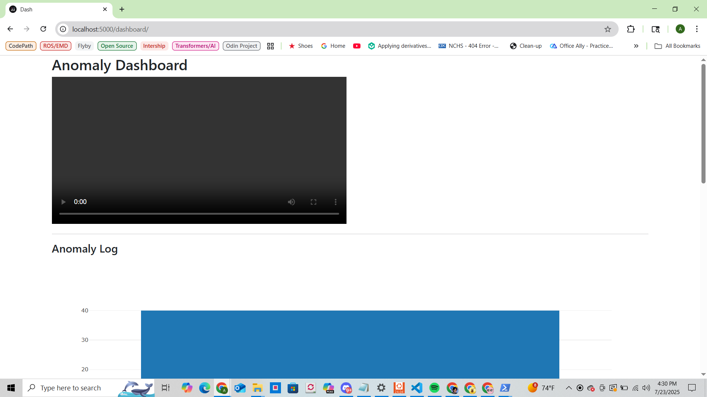
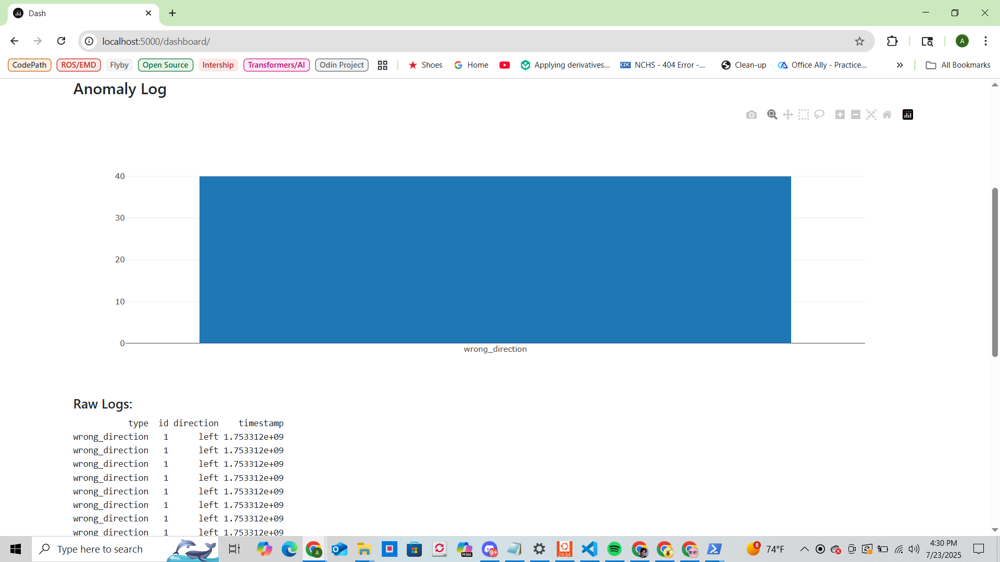

# Real-Time Person Detection Web App

This project is a real-time person detection system using [YOLOv8n](https://github.com/ultralytics/ultralytics) and OpenCV, streamed through a Flask web server. It uses your webcam to detect people in the video feed and displays it with bounding boxes in your browser.

---

## ✅ Week 1: Setup & Real-Time Detection

### Goals:
- Install Python, OpenCV, Flask, and YOLOv8n
- Capture webcam feed using OpenCV
- Run real-time person detection (using `yolov8n.pt`)
- Draw bounding boxes and labels
- Stream the processed video feed via Flask

---

## 📷 Live Demo Screenshot


---

## 🗂 Files

| File                | Description                                          |
|---------------------|------------------------------------------------------|
| `app.py`            | Flask app for streaming webcam detection             |
| `tracker.py`        | Local tracking script with CSV/video output          |
| `sort.py`           | SORT tracking algorithm                              |
| `anomaly_engine.py` | Rule engine for loitering, wrong direction, crowding |
| `yolov8n.pt`        | YOLOv8n model weights (ignored in Git)               |
| `.gitignore`        | Ignores venv, weights, cache, logs, etc.             |

---

## 🚀 How to Run

```bash
# (1) Create and activate a virtual environment
python -m venv venv
venv\Scripts\activate   # On Windows

# (2) Install dependencies
pip install ultralytics opencv-python flask

# (3) Run the app
python app.py

# (4) Open in browser
http://localhost:5000
```

## ✅ Week 2: Tracking & Movement Analysis

- Added SORT for ID-based person tracking
- Logs bounding box positions per frame
- Records dwell time, entry/exit, movement paths
- Outputs: `movement_log.csv` and `output.mp4`

---

## 🗂 Files

| File                    | Description                                                  |
|-------------------------|--------------------------------------------------------------|
| `app.py`                | Main Flask app to serve both stream and dashboard            |
| `dashboard.py`          | Dash app showing anomaly graph and video                     |
| `live_feed.py`          | Flask stream handler (imported in app.py)                    |
| `tracker.py`            | YOLOv8 + SORT tracker, outputs CSV/video                     |
| `anomaly_engine.py`     | Rule-based anomaly detector (loitering, wrong direction...)  |
| `person_detector_local.py` | Standalone detection script using webcam                  |
| `sort.py`               | SORT algorithm for tracking objects                          |
| `movement_log.csv`      | Output CSV of bounding box movements                         |
| `anomaly_log.jsonl`     | Structured anomaly logs per frame                            |
| `samples_data_vtest.avi`| Sample video used for testing                                |
| `images/`               | Contains screenshots or visual assets                        |
| `templates/`            | Jinja2 HTML template(s) used by Flask                        |
| `.gitignore`            | Excludes venv, cache, weights, logs, etc.                    |
| `README.md`             | Project documentation                                        |

---

## 🚀 How to Run `tracker.py`

```bash
# Ensure dependencies are installed
pip install ultralytics opencv-python filterpy

# Run local tracker
python tracker.py
```
---

## ✅ Week 3: Anomaly Detection + Rule Engine

- Added `anomaly_engine.py` for real-world rule-based anomaly detection
- Flags:
  - **Loitering**: Track ID stays in a region for over 30 seconds
  - **Wrong Direction**: Movement vector contradicts expected flow
  - **Overcrowding**: More than 3 persons within a defined area
- Saves anomalies to structured `.jsonl` logs
- Draws alerts in red bounding boxes on screen
- Outputs: `anomaly_log.jsonl`

---
## 🚀 How to Run `anomaly_engine.py`

```bash
# Ensure dependencies are installed
pip install ultralytics opencv-python filterpy numpy

# Run anomaly detection
python anomaly_engine.py
```
---

## ✅ Week 4: Dashboard & Visualization

- Built a Dash-based analytics dashboard integrated with Flask
- Dashboard displays:
  - Embedded anomaly video (`anomaly_output.mp4`)
  - Bar graph of anomaly type frequency from `anomaly_log.jsonl`
  - Raw anomaly log data viewer
- Accessible at `/dashboard/` while Flask app is running

---

### 📊 How to Run the Dashboard

```bash
# Install additional dependencies
pip install dash dash-bootstrap-components pandas

# Start the app (same as before)
python app.py

# Visit in browser
http://localhost:5000/dashboard/
```
## 🖼 Dashboard Preview

Includes video playback, bar chart of anomaly types, and a raw log viewer.

| Video Playback | Anomaly Log Chart |
|----------------|-------------------|
|  |  |

---

## 📝 Outputs

- **`movement_log.csv`**: Logs `frame`, `track_id`, `x1`, `y1`, `x2`, `y2` for each detection box
- **`anomaly_log.jsonl`**: Anomalies with `timestamp`, `track_id`, and `type` (e.g., loitering)
- **`output.mp4`** *(if saved)*: Video with tracked persons and ID overlays
- **`anomaly_output.mp4`** *(if generated)*: Video with anomaly alerts highlighted

## ⚙️ Tech Stack

- **Python** – main programming language  
- **OpenCV** – video capture, frame processing, drawing overlays  
- **Flask** – serves live video streams and dashboard UI  
- **YOLOv8 (Ultralytics)** – real-time person detection model  
- **SORT** – tracking algorithm for consistent ID assignment  
- **FilterPy** – supports Kalman filter in SORT  
- **NumPy** – array/math operations for detection logic  
- **CSV & JSONL** – structured logging for movement and anomalies  
- **MP4 (OpenCV VideoWriter)** – saves annotated video output  
- **Jinja2 (via Flask)** – for rendering dashboard HTML templates
