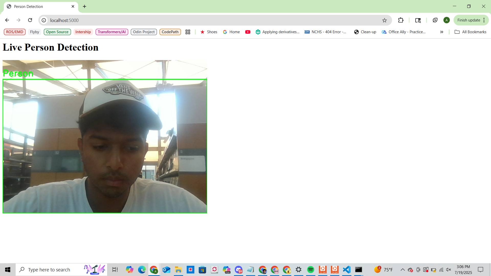

# Real-Time Person Detection Web App

This project is a real-time person detection system using [YOLOv8n](https://github.com/ultralytics/ultralytics) and OpenCV, streamed through a Flask web server. It uses your webcam to detect people in the video feed and displays it with bounding boxes in your browser.

---

## ✅ Week 1: Setup & Real-Time Detection

### Goals:
- Install Python, OpenCV, Flask, and YOLOv8n
- Capture webcam feed using OpenCV
- Run real-time person detection (using `yolov8n.pt`)
- Draw bounding boxes and labels
- Stream the processed video feed via Flask

---

## 📷 Live Demo Screenshot



---

## 🗂 Files

| File              | Description                                 |
|-------------------|---------------------------------------------|
| `app.py`          | Main Flask app for streaming detection      |
| `person_detector.py` | Local test script (optional/archived)     |
| `yolov8n.pt`      | YOLOv8n model weights (ignored in Git)      |
| `.gitignore`      | Ignores venv, model weights, cache, etc.    |

---

## 🚀 How to Run

```bash
# (1) Create and activate a virtual environment
python -m venv venv
venv\Scripts\activate   # On Windows

# (2) Install dependencies
pip install ultralytics opencv-python flask

# (3) Run the app
python app.py

# (4) Open in browser
http://localhost:5000
```

## ✅ Week 2: Tracking & Movement Analysis

- Added SORT for ID-based person tracking
- Logs bounding box positions per frame
- Records dwell time, entry/exit, movement paths
- Outputs: `movement_log.csv` and `output.mp4`

---

## 🗂 Files

| File              | Description                                  |
|-------------------|----------------------------------------------|
| `app.py`          | Flask app for streaming webcam detection     |
| `tracker.py`      | Local tracking script with CSV/video output  |
| `sort.py`         | SORT tracking algorithm                      |
| `yolov8n.pt`      | YOLOv8n model weights (ignored in Git)       |
| `.gitignore`      | Ignores venv, weights, cache, etc.           |

---

## 🚀 How to Run `tracker.py`

```bash
# Ensure dependencies are installed
pip install ultralytics opencv-python filterpy

# Run local tracker
python tracker.py
```
## 📝 Outputs

- **`movement_log.csv`**: Logs `frame`, `track_id`, `x1`, `y1`, `x2`, `y2` (bounding box coordinates)
- **`output.mp4`**: Video with tracked persons and ID annotations

## ⚙️ Tech Stack

- **Python** – general-purpose programming language  
- **OpenCV** – real-time computer vision library  
- **Flask** – lightweight Python web framework  
- **YOLOv8 (Ultralytics)** – object detection model for identifying people in video frames
- **SORT – simple object tracking (ID-based tracking)
- **FilterPy – Kalman filter library used by SORT
- **NumPy – matrix and array operations
- **CSV – structured logging of movement data
- **MP4 VideoWriter – exports annotated video
